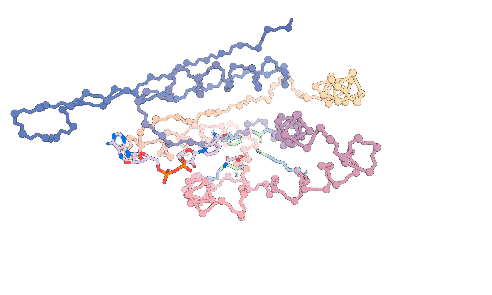

# RFdiffusion 2

Open source code for RFdiffusion2 as described in the following pre-print.

```bib
@article{ahern2025atom,
  title={Atom level enzyme active site scaffolding using RFdiffusion2},
  author={Ahern, Woody and Yim, Jason and Tischer, Doug and Salike, Saman and Woodbury, Seth M and Kim, Donghyo and Kalvet, Indrek and Kipnis, Yakov and Coventry, Brian and Altae-Tran, Han Raut and others},
  journal={bioRxiv},
  pages={2025--04},
  year={2025},
  publisher={Cold Spring Harbor Laboratory}
}
```

## Set-up

1. **Clone the repo.**

2. **Add the repo to your PYTHONPATH**

   If you installed the repo into `/my/path/to/rfdiffusion`, then run:
   ```bash
   export PYTHONPATH="/my/path/to/rfdiffusion"
   ```

3. **Download the model weights and containers:**
   ```bash
   python setup.py
   ```

4. **Install apptainer**

   RFdiffusion 2 (RFD2) uses [apptainer](https://apptainer.org) to simplify the environment set-up.
   Please follow the apptainer [installation instructions](https://apptainer.org/docs/admin/main/installation.html) for your operating system.

   If you manage your packages on linux with `apt` you can simply run:
   ```bash
   sudo add-apt-repository -y ppa:apptainer/ppa
   sudo apt update
   sudo apt install -y apptainer
   ```

   Once apptainer is installed, the image is provided as:
   ```
   rf_diffusion/exec/bakerlab_rf_diffusion_aa.sif
   ```

   You can then run commands as such:
   ```bash
   apptainer exec --nv exec/bakerlab_rf_diffusion_aa.sif <path-to-python_file> <args>
   ```


## Inference

To run a demo of some of the inference capabilities, including enzyme design from an atomic motif + small molecule, enzyme design from an atomic motif of unknown sequence positions + small molecule, and small-molecule binder design (with RASA conditioning to enforce burial of the small molecule).  
(See `rf_diffusion/benchmark/demo.json` for how these tasks are declared.)  Note that this will be extremely slow if not run on a GPU.

The default argument `in_proc=True` in `open_source_demo.yaml` makes the script run locally. With `in_proc=False` the pipeline will automatically distribute the tasks using SLURM, but this is not yet supported.  
The demo generates 150 residue proteins with many of the residues atomized, so it can take upwards of 30 minutes to run all cases.  Each case may take up to 10 minutes on an RTX2060.

**Run single demo case:**
```bash
apptainer exec --nv rf_diffusion/exec/bakerlab_rf_diffusion_aa.sif rf_diffusion/benchmark/pipeline.py --config-name=open_source_demo sweep.benchmarks=active_site_unindexed_atomic_partial_ligand
```

**Run all demo cases:**
```bash
apptainer exec --nv rf_diffusion/exec/bakerlab_rf_diffusion_aa.sif rf_diffusion/benchmark/pipeline.py --config-name=open_source_demo
```

The outputs will be written to:
```
pipeline_outputs/${now:%Y-%m-%d}_${now:%H-%M-%S}_open_source_demo
```

This runs only the design stage of the pipeline.  In order to continue through sequence-fitting with LigandMPNN and folding with Chai1, pass the command line argument: `stop_step=''`.  Note that Chai1 cannot run on all GPU architectures.

Pipeline runs can be resumed by passing `outdir=/path/to/your/output/directory`.


## Viewing Designs

Visualizing the design outputs can be confusing when looking at the raw .pdb files, especially for unindexed motif scaffolding, in which the input motif is incorporated into the protein at indices of the network's choice.  
To simplify this, we provide scripts for visualizing the outputs of the network that interact with a local pymol instance over XMLRPC.

Download [pymol](https://www.pymol.org/) and run it as an XMLRPCServer with:
```bash
./pymol -R
```

### Pymol and designs on the same machine

Run:
```bash
apptainer exec rf_diffusion/exec/bakerlab_rf_diffusion_aa.sif rf_diffusion/dev/show_bench.py --clear=True --key=name '/absolute/path/to/pipeline_outputs/output_directory/*.pdb'
```

This command will display the predicted X1 at each step in the flow-matching trajectory for each design in the output directory.  
You should see something like:



**Legend:**
- Atomized protein motif atoms : green.
- Atomized protein motif atoms : blue.
- Backbone protein motif atoms : yellow.
- The generated backbone will be colored a pastel gradient.
- Any small molecules will have their carbon atoms colored purple.

### Pymol running locally, designs on remote GPU

It is common for users to be sshed into a gpu cluster for running designs.  
It is still possible to view designs on a remote computer from your local pymol, as long as your remote computer has a route to your local computer (via VPN or ssh proxy).

Simply find your hostname with:
```bash
hostname -I
192.168.0.113 100.64.128.68
```

The second number is the route to your computer.

Simply append `--pymol_url=http://100.64.128.68:9123` to the command, i.e. from your remote machine run:
```bash
apptainer exec rf_diffusion/exec/bakerlab_rf_diffusion_aa.sif rf_diffusion/dev/show_bench.py --clear=True --key=name '/absolute/path/to/pipeline_outputs/output_directory/*.pdb' --pymol_url=http://100.64.128.68:9123
```

## Additional Info

### Running the AME Benchmark

We crawled M-CSA for 41 enzymes where all reactants and products are present to create this benchmark.  
Only positon-agnostic tip atoms are provided to the network. 100 designs for each case are created. Run it with:
```bash
apptainer exec --nv rf_diffusion/exec/bakerlab_rf_diffusion_aa.sif rf_diffusion/benchmark/pipeline.py --config-name=enzyme_bench_n41_fixedligand in_proc=True
```
Running this entire benchmark will perform [41 active sites * 100 designs per active site * 8 sequences per design] chai folding runs, which will take a prohibitively long time on a single machine, but for reproducibility it is included.

### Pipeline Metrics

We also include the code that was used to benchmark the network.  
The outline of the benchmarking process is:
1. Use RFdiffusion2 to generate backbones
2. LigandMPNN for sequence fitting
3. Chai-1 for refolding

The final output csv shows many metrics about the designed structure.  
Notably, we consider motif recapitulation metrics to measure how well the network scaffolded the given motif.  
Motif recapitulation metrics follow the following formula:

```
contig_rmsd_a_b_s
```

Where:

- **a, b**: the proteins being compared:
  - `des`: The MPNN packed protein
  - `pred`: The Chai prediction
  - `ref`: The input PDB  
    (With the caveat that 'ref' is always omitted from the name.)

- **s**: the comparison type:
  - ` ` : backbone (N, Ca, C)
  - `c_alpha`: Ca
  - `full_atom`: All heavy atoms
  - `motif_atom`: Only motif heavy atoms

#### RFdiffusion2 Outputs

The network outputs the protein with both the indexed backbone region and the unindexed atomized region.  
After that several idealization steps are conducted; the backbone is idealized, the protein is deatomized and the unindexed residues are assigned their corresponding indexed residue (using a greedy algorithm that searches for the closest C-alpha in the indexed backbone).

There are two further idealization steps that are optional to users:
- If `inference.guidepost_xyz_as_design_bb == True`, then the unindexed coordinates overwrite the matched backbone. Otherwise only the sidechain (including C-beta) coordinates of the guidepost are used.
- If `inference.idealize_sidechain_outputs == True` then all atomized sidechains are idealized. This amounts to finding the set of torsions angles that minimizes the RMSD between the unidealized residue and the residue reconstructed from those torsion angles. Note: these torsions are the full RF All-Atom torsion set which includes not only torsions but also bends and twists e.g. C-Beta bend which can adopt values which would be of higher-strain than that seen in nature.

The protein at this point has sequence and structure for the motif regions but only backbone (N,Ca,C,O,C-Beta) coordinates for diffused residues (as well as any non-protein components e.g. small molecules).

#### LigandMPNN Outputs

Sequence is fit using LigandMPNN in a ligand-aware, motif-rotamer-aware mode. LigandMPNN also performs packing. LigandMPNN attempts to keep the motif rotamers unchanged, however the pack uses a more conservative set of torsions than RF All-Atom (i.e. fewer DoF) to pack the rotamers and thus there is often some deviation between the RF All-Atom-idealized and ligandmpnn-idealized motif rotamers. The idealization gap between the diffusion-output rotamer set and the RF All-Atom-idealized rotamer set can be found with metrics key: `metrics.IdealizedResidueRMSD.rmsd_constellation`. The corresponding gap between the rf2aa-idealized (or not idealized if `inference.idealize_sidechain_outputs == False`) rotamer set and the ligandmpnn-idealized rotamer set can be found with metrics key: `motif_ideality_diff`.

