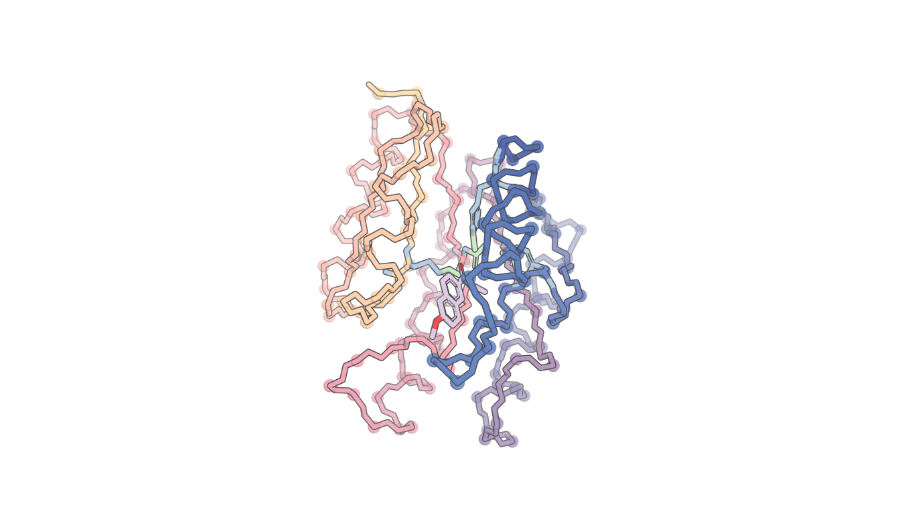

# Setup

## Dependencies
rf_diffusion now includes a pre-commit hook that runs ruff and yapf to autoformat files. If you run into an error, just run "pip install ruff yapf," or otherwise install the two packages. Most existing files are, for now, grandfathered out of autoformatting via inclusion in the .yapf_exclude file. If you really don't want your new files autoformatted, you can add them to that file. Linting and formatting will be applied before each commit. After the initial run, which may take ten seconds or so, formatting will be done incrementally and shouldn't slow you down.

## Paths
Let's define some paths. Begin by `cd`ing to any directory you like.
```
REPO_NAME="rf_diffusion_repo"  # Set REPO_NAME to be anything you like.
REPO_DIR="$PWD/$REPO_NAME"
```
Now clone the repo.
```
git clone -b aa git@github.com:baker-laboratory/rf_diffusion.git $REPO_NAME
cd $REPO_DIR
git submodule init
git submodule update --init
```

### Chai setup
If you are going to use Chai-1 rather than AF2 as a structure prediction oracle, take this additional step:

`git clone -b pdb_folder_rebase git@git.ipd.uw.edu:ai/chai.git lib/chai`
`cp -r /home/ahern/reclone/rf_diffusion_staging/lib/chai_weights lib/chai_weights`


## Verify tests pass
```
export PYTHONPATH="${PYTHONPATH}:$REPO_DIR"
cd $REPO_DIR/rf_diffusion
apptainer exec exec/bakerlab_rf_diffusion_aa.sif pytest --disable-warnings -s -m "not nondeterministic"
```
## A note about running scripts in this repo
Many of the python scripts in this repo are executable. That is, you don't need to do `python some_script.py` or `my_container.sif some_script.py`. The are several environmental variables and flags that need to be set properly for the scripts to run. Rather than asking the user to set these correctly each time (which is error prone), we have a script to do this prep work under the hood for you! 

Any scripts (like `rf_diffusion/benchmark/pipeline.py` and `rf_diffusion/run_inference.py`) that have the shebang line `#!/usr/bin/env -S /bin/sh -c '"$(dirname "$0")/exec/rf_diffusion_aa_shebang.sh" "$0" "$@"'` can be executed directly. If you need to run a script without that line, you need to do
```
export PYTHONPATH="${PYTHONPATH}:$REPO_DIR"
/usr/bin/apptainer run --nv --slurm --env PYTHONPATH="\$PYTHONPATH:$PYTHONPATH" path/to/rf_diffusion/exec/bakerlab_rf_diffusion_aa.sif path/to/script.py ...
```

# Simple inference pipeline run
## Running inference
To run a demo of some of the inference capabilities, including enzyme design from tip atoms, enzyme design from tip atoms of unknown sequence position, ligand binder design, traditional contiguous motif scaffolding, and molecular glue design (binder to protein:small_molecule complex).  (See `$REPO_DIR/rf_diffusion/benchmark/demo.json` for how these tasks are declared)

`$REPO_DIR/rf_diffusion/benchmark/pipeline.py --config-name=demo_only_design`

This will print the directory the designs are created in:
ic| conf.outdir: OUTDIR

Once the pipeline finishes (check sjobs for an array job named `sweep_hyperparameters`), view the designs:

## Viewing designs
First, start pymol:

`PYMOL_RPCHOST='0.0.0.0' PYMOL_BIN -R`

`PYMOL_BIN` on the digs is: `/software/pymol-2/bin/pymol`

Find your hostname with
`hostname -I`

Then run:
`$REPO_DIR/rf_diffusion/dev/show_bench.py --clear=True 'OUTDIR/*.pdb' --pymol_url=http://HOSTNAME:9123`

You should see multiple designs (such as this enzyme design) render in your pymol session:


To render some of the nice colors, you may need to add the files in `pymol_config` to your `.pymolrc`

## Running inference (OUTSIDE OF DIGS)
To run a simple pipeline with no mpnn/scoring for the tip atom case:

`$REPO_DIR/rf_diffusion/benchmark/pipeline.py --config-name=retroaldolase_demo_nodigs`

## Running catalytic constraint benchmarking

Put your un-mpnned designs in a folder, call it $MY_FOLDER

Each design is expected to be a .pdb, with a .trb file with the same file prefix.
The trb file is expected to contain a pickle that has the following structure:

```
{'con_hal_pdb_idx': [('A', 114), ('A', 115), ('A', 85)],
 'con_ref_pdb_idx': [('A', 1), ('A', 2), ('A', 3)],
 'con_ref_idx0': array([0, 1, 2]),
 'con_hal_idx0': array([113, 114,  84]),
 'config': {
	'contigmap': {'contig_atoms': "{'A1':'C','A2':'N,CA,CB,OG','A3':'NE2,CE1,ND1,CG,CD2'}"},
  	'inference': {
		'input_pdb': '/net/scratch/ahern/se3_diffusion/benchmarks/2023-12-13_02-40-19_sh_benchmark_1_bb_both/input/siteC.pdb',
   		'ligand': 'mu2'
		}
	}
}
```

Run python `./benchmark/pipeline.py --config-name=catalytic_constraints_from_designs outdir=$MY_FOLDER`

This will produce a metrics dataframe: $METRICS_DATAFRAME_PATH

Use $METRICS_DATAFRAME_PATH in the provided analysis notebook `notebooks/analyze_catalytic_constraints.ipynb` to analyze success on the various catalytic constraints.

If you do not have the dependencies to run this notebook in your default kernel, use this sif as a kernel `rf_diffusion/exec/bakerlab_rf_diffusion_aa.sif` following instructions in https://wiki.ipd.uw.edu/it/digs/apptainer#jupyter

## Running catalytic constraint design + benchmarking
`$REPO_DIR/rf_diffusion/benchmark/pipeline.py --config-name=sh_benchmark_1_tip-true_selfcond-false_seqposition_truefalse_T150`

This will make 50 * 2 [+/- sequence position] * 6 [6 different active site descriptions] = 600 designs = 600 * 8 (MPNN runs/design) = 4800 sequences

All motifs are tip atom motifs for 150 timesteps with no self-conditioning


# Benchmarking guide

The ODE solver returns the guideposted, atomized protein.

The backbone is idealized.

The protein is deatomized.

The guideposts are placed.  A greedy search matches each guidepost to its nearest remaining C-alpha.
If `inference.guidepost_xyz_as_design_bb == True`, then the guidepost coordinates overwrite the matched backbone.  Otherwise only the sidechain (including C-beta) coordinates of the guidepost are used.

If `inference.idealize_sidechain_outputs == True` then all atomized sidechains are idealized.  This amounts to finding the set of torsions angles that minimizes the RMSD between the unidealized residue and the residue reconstructed from those torsion angles.  Note: these torsions are the full rf2aa torsion set which includes not only torsions but also bends and twists e.g. C-Beta bend which can adopt values which would be of higher-strain than that seen in nature.

The protein at this point has sequence and structure for the motif regions but only backbone (N,Ca,C,O,C-Beta) coordinates for diffused residues (as well as any non-protein components e.g. small molecules)

Sequence is fit using LigandMPNN in a ligand-aware, motif-rotamer-aware mode.  LigandMPNN also performs packing.  LigandMPNN attempts to keep the motif rotamers unchanged, however the pack uses a more conservative set of torsions than rf2aa (i.e. fewer DoF) to pack the rotamers and thus there is often some deviation between the rf2aa-idealized and ligandmpnn-idealized motif rotamers.  The idealization gap between the diffusion-output rotamer set and the rf2aa-idealized rotamer set can be found with metrics key: `metrics.IdealizedResidueRMSD.rmsd_constellation`.  The corresponding gap between the rf2aa-idealized (or not idealized if `inference.idealize_sidechain_outputs == False`) rotamer set and the ligandmpnn-idealized rotamer set can be found with metrics key: `motif_ideality_diff`.

Motif recapitulation metrics:

The following metrics follow a formula:

contig_rmsd_a_b_s

a,b: the proteins being compared:
	- des: The MPNN packed protein
	- pred: The AF2 prediction
	- ref: The input PDB
With the caveat that 'ref' is always omitted from the name.

s: the comparison type:
	- '': backbone (N, Ca, C)
	- 'c_alpha': Ca
	- 'full_atom': All heavy atoms
	- 'motif_atom': Only motif heavy atoms


# Running the enzyme benchmark

We crawled M-CSA for 41 enzymes where all reactants and products are present to create this benchmark.  Only positon-agnostic tip atoms and partial ligand positions are provided to the network.

100 designs for each case are created.

Run it with:

`./benchmark/pipeline.py --config-name=enzyme_bench_n41`

# Debugging

## pipeline.py
If your outdir is `/a/b/c/` then slurm logs appear at: `/a/b/SLURMJOBID_SLURMJOBARRAYINDEX_jobtype.log`

# PPI

You can compare protein-protein binder design between RFDAM and RFDiffusion by generating length 100 binders against the 5 binder design benchmark cases described in the RFDiffusion paper, by running this command:

`./benchmark/pipeline.py -cn ppi_comparison_pilot`

To visualize the trajectories created during the "sweep" step in PYMOL:
`./dev/show_bench.py --clear=1 'YOUR_OUTPUT_DIR_HERE/*.trb' --key=name --ppi=1 --des=0`

To visualize the designs as cartoons once the MPNN step is complete in PYMOL:
`./dev/show_bench.py --clear=1 'YOUR_OUTPUT_DIR_HERE/*.trb' --key=name --ppi=1 --mpnn_packed=1 --des=0 --cartoon=1 --structs='{}'`